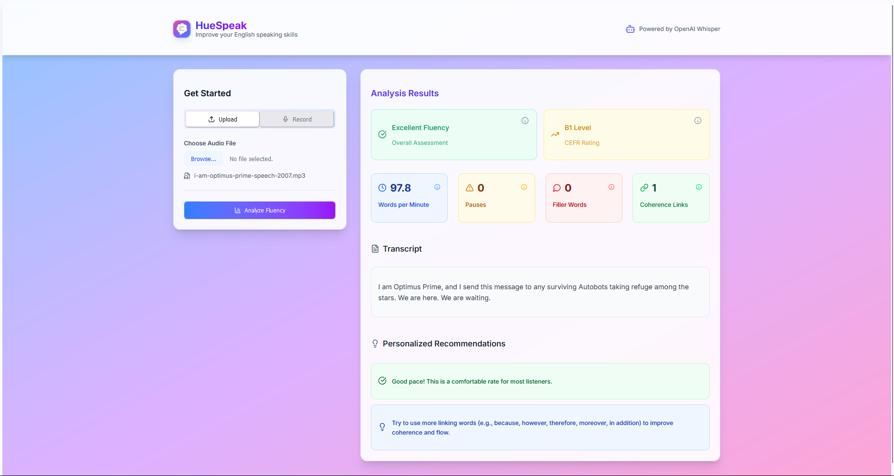

# SpeakEasy – English Speaking Fluency Analyzer
*“A Safe Space to Speak Freely and Improve Fluency”*

A modern web app to analyze and improve your English speaking fluency. Get instant, actionable feedback on speech rate, pauses, fillers, coherence, CEFR rating, and more!

---

## 🚀 Features

- **Upload or Record Speech**: Supports browser microphone selection and audio file upload.
- **Fluency Metrics**: Analyzes speech rate (WPM), pauses, filler words, and coherence (linking words).
  - **Vocabulary Diversity**: Measures the range of unique words you use (type-token ratio), a key factor in TOEFL, IELTS, and PTE scoring.
  - **Grammar Error Detection**: Instantly spots possible grammar mistakes in your transcript, as assessed in global English tests.
  - **Sentence Complexity**: Provides feedback on your average sentence length, reflecting your ability to use complex sentences as in IELTS and PTE.
- **CEFR Rating**: Maps your fluency to the international CEFR scale (A1–C2).
- **Personalized Recommendations**: Actionable, color-coded feedback to help you improve.
- **Modern UI**: Beautiful, responsive, and accessible interface with vibrant gradients and clear visual cues.
- **Tooltips & Explanations**: Hover over info icons to learn what each metric means.
- **Preview & Troubleshooting**: Listen to your recording before analyzing; get clear troubleshooting tips if something doesn't work.

---

## 📚 Future Recommendations (Rubric-Based Features)

- **Automated Pronunciation Scoring:** Integrate advanced ASR or third-party APIs to assess pronunciation, as done in Versant and PTE.
- **Full Band Scoring:** Map user performance to band descriptors used in IELTS and TOEFL for more granular proficiency feedback.
- **Task Response & Content:** Evaluate how well users address prompts or questions, similar to IELTS speaking tasks.
- **Pronunciation, Grammar, and Lexical Resource:** Expand feedback to cover all rubric areas from international English tests.
- **Adopt Criteria from Versant, TOEFL, IELTS, and Pearson Test of English:** Continue research and implementation to align with these global standards for spoken English assessment.

*Contributions and suggestions from English educators and assessment experts are highly welcome!*

---

## 🖼️ Screenshot

> 

---

## 🛠️ Tech Stack

- **Frontend**: React, Vite, Tailwind CSS, Lucide Icons, Chart.js, Framer Motion
- **Backend**: FastAPI (Python), Whisper (speech-to-text), librosa (audio analysis)
- **Other**: Node.js, npm, ffmpeg (audio conversion)

---

## ⚡ Detailed Setup Instructions

### Prerequisites

Before you begin, ensure you have the following installed on your system:

- **Python 3.9 or higher**: [Download Python](https://www.python.org/downloads/)
- **Node.js 16.0 or higher**: [Download Node.js](https://nodejs.org/)
- **npm** (comes with Node.js)
- **ffmpeg**: [Download ffmpeg](https://ffmpeg.org/download.html) and ensure it's added to your system PATH
  - To verify installation: Open terminal/command prompt and run `ffmpeg -version`

### Project Structure

```
EnglishFluencyEmpathicApp/
├── backend/                 # FastAPI backend server
│   ├── app/                 # Main application code
│   │   └── main.py          # API endpoints
│   ├── requirements.txt     # Python dependencies
│   └── venv/                # Python virtual environment (created during setup)
├── frontend/                # React frontend
│   ├── src/                 # Source code
│   ├── package.json         # Node.js dependencies
│   └── vite.config.js       # Vite configuration
├── README.md                # This file
└── image.png                # Screenshot
```

### Backend Setup (FastAPI + Python)

1. **Navigate to the project root directory:**
   ```bash
   cd EnglishFluencyEmpathicApp
   ```

2. **Create and activate a Python virtual environment:**
   
   **Windows:**
   ```bash
   python -m venv backend
   backend\Scripts\activate
   ```
   
   **Mac/Linux:**
   ```bash
   python3 -m venv backend
   source backend/bin/activate
   ```
   
   You should see `(backend)` at the beginning of your command prompt, indicating the virtual environment is active.

3. **Install Python dependencies:**
   ```bash
   cd backend
   pip install -r requirements.txt
   ```
   
   This will install:
   - FastAPI - Web framework
   - Uvicorn - ASGI server
   - librosa - Audio analysis
   - scikit-learn - Machine learning utilities
   - transformers - Hugging Face models
   - torch - PyTorch (for Whisper)
   - openai-whisper - Speech-to-text model
   - language-tool-python - Grammar checking

4. **Download the Whisper model (automatic on first run):**
   The Whisper model will be automatically downloaded when you first run the application. This may take several minutes depending on your internet connection. The model will be cached for future use.

5. **Run the backend server:**
   ```bash
   python -m uvicorn app.main:app --reload
   ```
   
   The backend API will be available at [http://localhost:8000](http://localhost:8000)
   
   You can verify it's working by visiting [http://localhost:8000/docs](http://localhost:8000/docs) to see the API documentation.

### Frontend Setup (React + Vite)

1. **Open a new terminal/command prompt** (keep the backend running in the previous terminal)

2. **Navigate to the frontend directory:**
   ```bash
   cd EnglishFluencyEmpathicApp/frontend
   ```

3. **Install Node.js dependencies:**
   ```bash
   npm install
   ```
   
   This will install:
   - React and React DOM
   - Chart.js and react-chartjs-2 for data visualization
   - Lucide React for icons
   - Framer Motion for animations
   - Tailwind CSS for styling
   - Vite for development server

4. **Run the frontend development server:**
   ```bash
   npm run dev
   ```
   
   The frontend will be available at [http://localhost:5173](http://localhost:5173)

### Running Both Services Together

To use the complete application:

1. Start the backend server (as described above)
2. In a separate terminal, start the frontend development server
3. Open your browser and navigate to [http://localhost:5173](http://localhost:5173)
4. The application should automatically connect to the backend API

---

## 🌟 Usage

- **Record or upload** your speech.
- **Preview** your audio before analysis.
- **Click "Analyze Fluency"** to get detailed feedback.
- **Review metrics** including WPM, filler words, coherence, CEFR rating, and more.
- **Follow personalized recommendations** to improve your English speaking skills.

---

## 🔧 Troubleshooting

### Common Issues and Solutions

**1. "ffmpeg is not recognized" or "command not found"**
- Ensure ffmpeg is properly installed and added to your system PATH
- Restart your terminal/command prompt after installing ffmpeg
- On Windows, you may need to add the ffmpeg bin directory to your PATH manually

**2. Backend fails to start with import errors**
- Ensure you've activated the virtual environment
- Verify all dependencies are installed with `pip install -r requirements.txt`
- Check that you're using Python 3.9 or higher

**3. Frontend fails to start with dependency errors**
- Delete `node_modules` folder and `package-lock.json` file
- Run `npm install` again
- Ensure you're using Node.js 16.0 or higher

**4. "Connection refused" when trying to analyze speech**
- Ensure the backend server is running
- Check that the frontend can access [http://localhost:8000](http://localhost:8000)
- Verify CORS is properly configured (should be set up already)

**5. Whisper model download fails or is very slow**
- Check your internet connection
- Try using a VPN if you're in a region with restricted access
- The model will be cached after first successful download

**6. Grammar analysis not working**
- language-tool-python requires an internet connection for full functionality
- Some grammar checks may be limited without internet access

### System Requirements

- **RAM**: Minimum 4GB recommended (8GB+ for better performance)
- **Storage**: At least 5GB free space (for Whisper models and dependencies)
- **Internet**: Required for initial setup and some features
- **Browser**: Modern browser (Chrome, Firefox, Edge, Safari)

---

## 📖 Additional Information

### How It Works

1. **Audio Processing**: When you upload or record speech, the audio is processed using librosa for feature extraction
2. **Speech-to-Text**: OpenAI's Whisper model converts your speech to text
3. **Fluency Analysis**: Multiple metrics are calculated:
   - Words per minute (WPM)
   - Filler word detection
   - Pause analysis
   - Coherence assessment
   - Vocabulary diversity
   - Grammar error detection
4. **CEFR Rating**: Results are mapped to the Common European Framework of Reference for Languages
5. **Feedback Generation**: Personalized recommendations are generated based on your performance

### Data Privacy

- All audio processing happens locally on your machine
- No data is sent to external servers (except for grammar checking which requires internet access)
- Audio files are temporarily stored and deleted after analysis
- Your speech data is not stored or shared with third parties

### Contributing

Contributions are welcome! Please feel free to submit a Pull Request.

1. Fork the repository
2. Create your feature branch (`git checkout -b feature/AmazingFeature`)
3. Commit your changes (`git commit -m 'Add some AmazingFeature'`)
4. Push to the branch (`git push origin feature/AmazingFeature`)
5. Open a Pull Request

---

## 📞 Support

If you encounter any issues or have questions, please open an issue on the GitHub repository or contact the maintainers.

---

## 📄 License

This project is licensed under the MIT License - see the LICENSE file for details.
